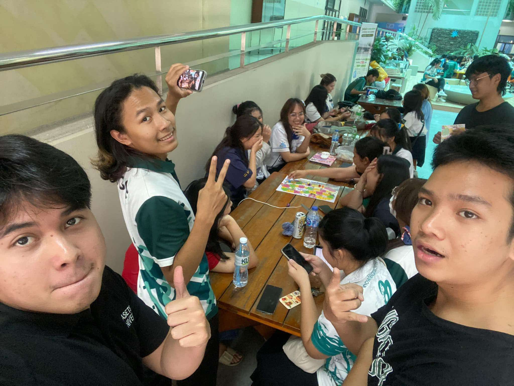
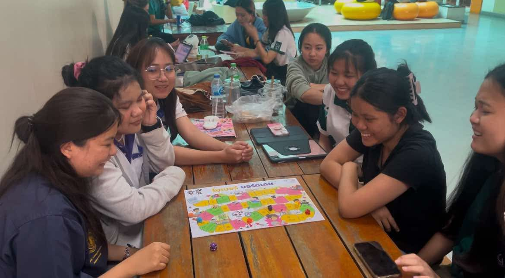
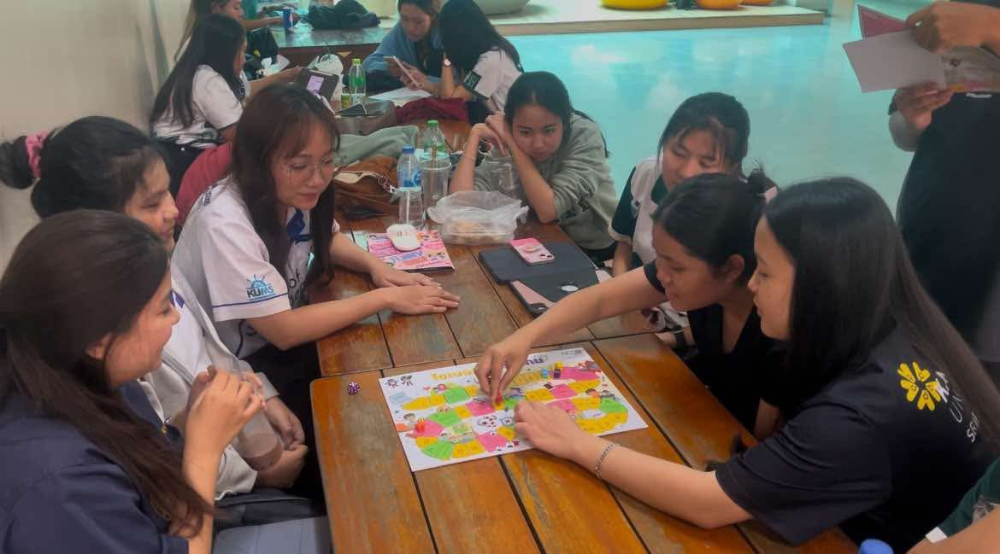
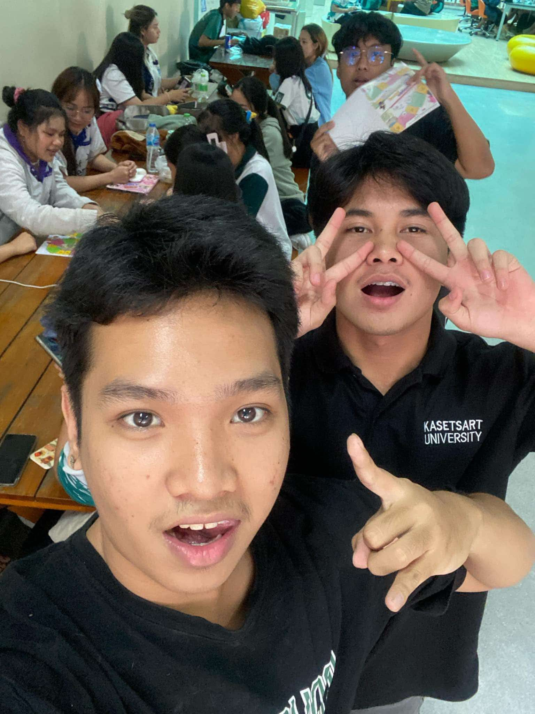
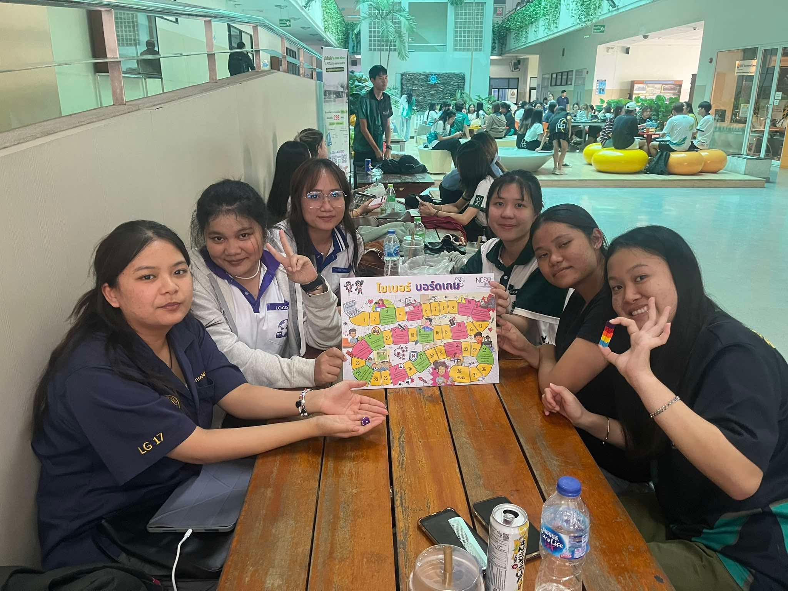

# **Securing the Human**  
## **Group:** Seksan-Salahsakul  

---

## **🌟 ภาพกิจกรรม**  
### **ภาพกิจกรรมที่ 1**  
  

### **ภาพกิจกรรมที่ 2**  
  

### **ภาพกิจกรรมที่ 3**  
  

### **ภาพกิจกรรมที่ 4**  
  

กิจกรรมนี้จัดทำโดยกลุ่ม **"Seksan-Salahsakul"** นิสิตสาขาวิทยาการคอมพิวเตอร์ (Computer Science) ซึ่งได้ดำเนินงานกิจกรรม **"เล่น Boardgame Cyber จาก NCSA"** เพื่อตระหนักรู้ถึงความสำคัญของโลกไซเบอร์  

กลุ่มเป้าหมายของกิจกรรมนี้คือ **นิสิตคณะวิทยาการจัดการ สาขาการจัดการโลจิสติกส์ ชั้นปีที่ 3 จำนวน 6 คน** ซึ่งทุกท่านได้เข้าร่วมกิจกรรมด้วยความสนุกสนาน และได้มีการเก็บภาพและวิดีโอที่ได้รับอนุญาตจากกลุ่มตัวอย่างเรียบร้อยแล้ว  

---

## **📅 วันที่ทำกิจกรรมและสถานที่**  
**วันจันทร์ที่ 21 มกราคม 2025**  
ณ **ตึก 10 มหาวิทยาลัยเกษตรศาสตร์ วิทยาเขตศรีราชา**  

---

## **📖 สิ่งที่ได้รับจาก Boardgame Cyber**  
🎮 **ความสนุกสนาน:** ผู้เข้าร่วมกิจกรรมเพลิดเพลินกับการเล่นเกม  
📴 **การพักสายตา:** ลดเวลาใช้หน้าจอและเทคโนโลยี  
🗣️ **การแลกเปลี่ยนความคิดเห็น:** พูดคุยและถกเถียงเกี่ยวกับความปลอดภัยในโลกไซเบอร์  
⚠️ **ความตระหนักรู้:** เข้าใจถึงความเสี่ยงในโลกไซเบอร์ และแนวทางป้องกัน  

---

## **🌈 ภาพรวมของกิจกรรม**  
- **📸 ภาพหมู่หลังจบกิจกรรม:**  
    
- **📹 วิดีโอกิจกรรม:**  
  [คลิกเพื่อรับชมวิดีโอ](https://youtu.be/jQjWgcT8QnA?si=njWl4ED7XrX26aYa)  

---

## **👥 สมาชิกกลุ่ม Seksan-Salahsakul**  
1. 🌟 **Tante Wanitchakorn** → [Github Page](https://huggies2003.github.io/Boardgame)  
2. 🌟 **Poramet Obyam** → [Github Page](https://poramet04.github.io/Boardgame)  
3. 🌟 **Vorapol Boonrasri** → [Github Page](https://Vorxp.github.io/boardgame)  
4. 🌟 **Wasawat Boonporn** → [Github Page](https://isnname.github.io/boardgame)  

---
